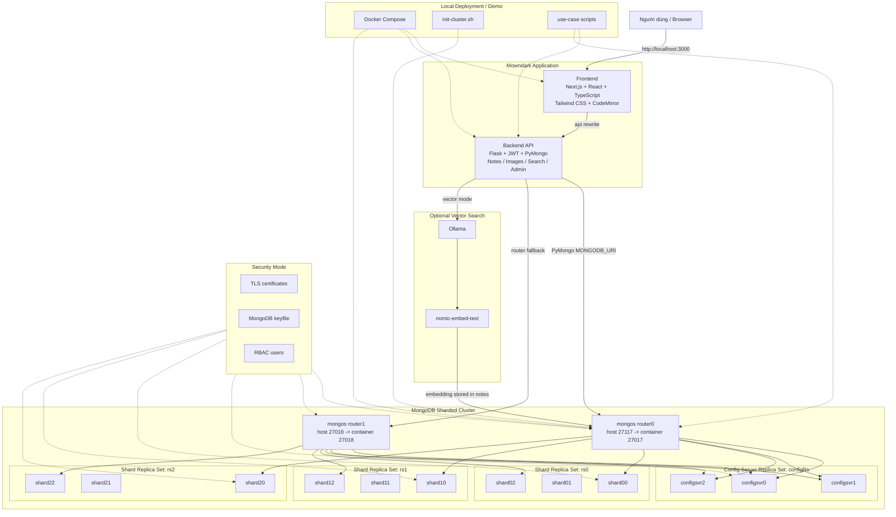
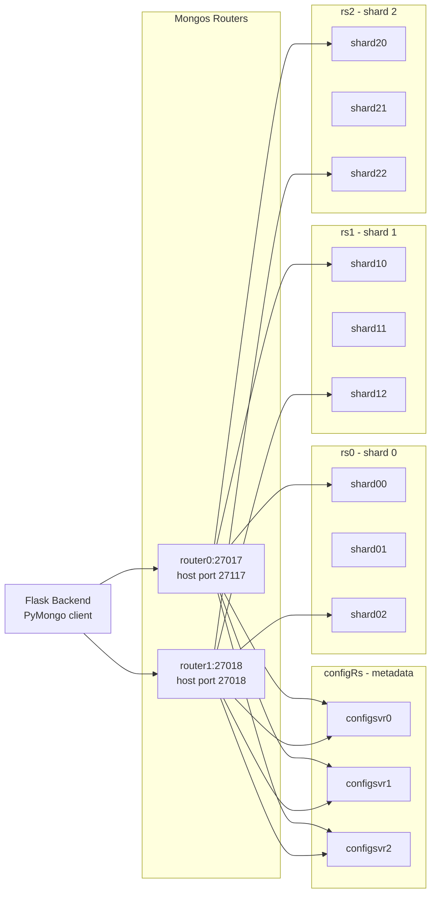
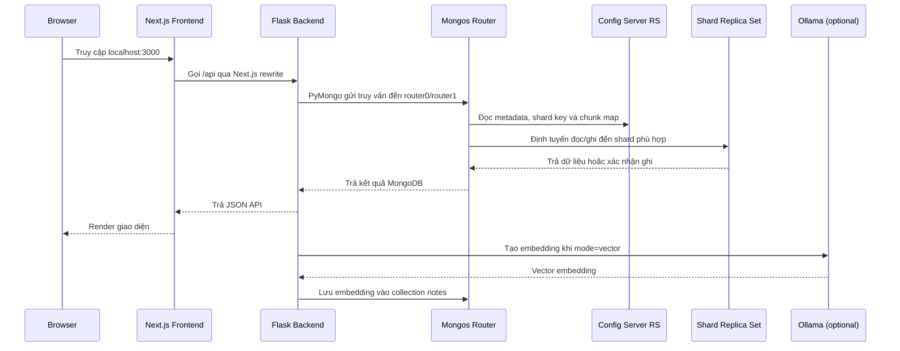

# Đồ án NT132.Q21.ANTN: MongoDB Sharded Cluster

## Giới thiệu

Đây là đồ án môn **NT132.Q21.ANTN** về triển khai và vận hành **MongoDB Cluster**. Nội dung chính của đồ án là xây dựng một hệ thống MongoDB phân tán có **Replica Set**, **Config Server**, **Sharding** và **Mongos Router**, sau đó kết nối hệ thống này với ứng dụng demo **Mowndark**.

Mowndark là ứng dụng ghi chú Markdown dùng để minh họa cách một ứng dụng thực tế đọc, ghi, tìm kiếm và quản lý dữ liệu thông qua MongoDB sharded cluster thay vì kết nối trực tiếp đến từng shard.

## Nội dung repository

- `FINAL/`: phiên bản triển khai hoàn chỉnh của đồ án.
- `app/`, `replica-set/`, `sharded/`: các phần thử nghiệm/lab ban đầu cho ứng dụng đơn giản, replica set và sharding.

Trong đó, `FINAL/` là phần cần dùng khi chạy demo cuối cùng.

```text
FINAL/
├── docker-compose.yml
├── scripts/
│   ├── init-cluster.sh
│   └── mongo/
│       ├── init-configsvr.js
│       ├── init-rs0.js
│       ├── init-rs1.js
│       ├── init-rs2.js
│       ├── init-shards.js
│       ├── enable-app-sharding.js
│       ├── seed-notes.js
│       └── test-sharding.js
├── backend/
│   ├── app.py
│   ├── database.py
│   ├── models/
│   └── routes/
└── frontend/
    ├── package.json
    └── src/
```

## Kiến trúc hệ thống

Theo kiến trúc `mowndark/local`, hệ thống được tách thành lớp ứng dụng Mowndark và lớp MongoDB sharded cluster phía sau `mongos`. Trong thư mục `FINAL/`, các thành phần này được đóng gói chung trong Docker Compose để chạy demo end-to-end.

- **Frontend**: Next.js, chạy tại `http://localhost:3000`.
- **Backend**: Flask API, chạy tại `http://localhost:5000`.
- **Mongos Router**: 2 router để ứng dụng truy cập cluster.
- **Config Server Replica Set**: 3 node lưu metadata của sharded cluster.
- **Shard Replica Sets**: 3 shard, mỗi shard là một replica set gồm 3 node.
- **Optional Vector Search**: Ollama dùng model `nomic-embed-text` khi bật tìm kiếm vector.
- **Security Mode**: TLS, keyfile và RBAC cho MongoDB khi chạy kịch bản bảo mật.

Các khối `Optional Vector Search`, `Security Mode` và `use-case scripts` là phần mở rộng trong kiến trúc local tham chiếu; stack demo chính vẫn chạy được khi không bật các khối này.



### Topology MongoDB Cluster



### Thành phần MongoDB

| Thành phần | Replica set | Node |
| --- | --- | --- |
| Config Server | `configRs` | `configsvr0`, `configsvr1`, `configsvr2` |
| Shard 0 | `rs0` | `shard00`, `shard01`, `shard02` |
| Shard 1 | `rs1` | `shard10`, `shard11`, `shard12` |
| Shard 2 | `rs2` | `shard20`, `shard21`, `shard22` |
| Router 0 | - | `router0`, publish ra host tại `27117` |
| Router 1 | - | `router1`, publish ra host tại `27018` |

Backend mặc định kết nối đến cluster bằng URI nội bộ:

```text
mongodb://router0:27017,router1:27018/mowndark
```

Từ máy host có thể kết nối qua:

```text
mongodb://127.0.0.1:27117/mowndark
mongodb://127.0.0.1:27018/mowndark
```

### Luồng request chính



## Dữ liệu và sharding

Database chính của ứng dụng là `mowndark`. Script khởi tạo tạo các collection và index cần thiết:

- `users`: tài khoản người dùng.
- `notes`: ghi chú Markdown.
- `images`: ảnh upload được lưu trong MongoDB.
- `audit_logs`: log cho các thao tác demo/lab.
- `write_concern_demo`: dữ liệu dùng để so sánh write concern.
- `backups_metadata`: metadata dự phòng cho các kịch bản mở rộng.

Các cấu hình sharding chính:

- Bật sharding cho database `mowndark`.
- Shard collection `mowndark.notes` theo key `{ shortid: 1 }`.
- Shard collection `mowndark.images` theo key `{ _id: "hashed" }`.
- Shard collection `mowndark.audit_logs` theo key `{ _id: "hashed" }`.
- Tạo text index cho `notes.title` và `notes.content` để hỗ trợ tìm kiếm văn bản.

Script `seed-notes.js` nạp sẵn một số ghi chú mẫu phục vụ demo tìm kiếm và phân phối dữ liệu.

## Chức năng ứng dụng Mowndark

Mowndark minh họa các thao tác thường gặp của một ứng dụng web dùng MongoDB cluster:

- Đăng ký, đăng nhập và xác thực bằng JWT.
- Tạo, sửa, xóa và xem ghi chú Markdown.
- Editor Markdown có chế độ edit, split view và preview.
- Upload ảnh và lưu ảnh vào MongoDB.
- Chia sẻ ghi chú bằng link công khai dạng `/s/<shortid>`.
- Quyền truy cập ghi chú: `freely`, `editable`, `limited`, `locked`, `protected`, `private`.
- Tìm kiếm text qua MongoDB text index.
- Tìm kiếm vector tùy chọn qua Ollama embedding.
- Trang admin lab để xem trạng thái cluster, danh sách shard, thống kê search và thử nghiệm write concern.

## Yêu cầu

- Docker
- Docker Compose plugin (`docker compose`) hoặc `docker-compose`

Không cần cài MongoDB hoặc `mongosh` trên máy host vì các lệnh kiểm tra có thể chạy bên trong container MongoDB.

## Cách chạy demo cuối cùng

Chạy toàn bộ stack:

```bash
cd FINAL
docker compose up -d --build
```

Đợi các container MongoDB khởi động trong vài giây, sau đó khởi tạo cluster:

```bash
chmod +x scripts/init-cluster.sh
./scripts/init-cluster.sh
```

Script `init-cluster.sh` sẽ lần lượt:

1. Khởi tạo config server replica set `configRs`.
2. Khởi tạo các shard replica set `rs0`, `rs1`, `rs2`.
3. Thêm 3 shard vào sharded cluster.
4. Bật sharding cho database `mowndark`.
5. Tạo collection, index và shard key cho ứng dụng.
6. Nạp dữ liệu ghi chú mẫu.

Sau khi hoàn tất, truy cập:

- Frontend: `http://localhost:3000`
- Backend health check: `http://localhost:5000/health`
- API status: `http://localhost:5000/api/status`
- Cluster status: `http://localhost:5000/api/cluster/status`

## Kiểm tra cluster

Xem trạng thái các service:

```bash
cd FINAL
docker compose ps
```

Xem danh sách shard qua `mongos`:

```bash
docker compose exec router0 mongosh --quiet --eval "sh.status()"
```

Kiểm tra số lượng ghi chú mẫu:

```bash
docker compose exec router0 mongosh --quiet --eval "db.getSiblingDB('mowndark').notes.countDocuments()"
```

Chạy kịch bản smoke test sharding:

```bash
docker compose exec router0 mongosh --quiet /scripts/test-sharding.js
```

Gọi API kiểm tra cluster:

```bash
curl http://localhost:5000/api/cluster/status
```

## API chính

Một số endpoint quan trọng của backend:

| Endpoint | Mục đích |
| --- | --- |
| `GET /health` | Health check tổng quát |
| `GET /api/status` | Trạng thái ứng dụng |
| `GET /api/status/config` | Cấu hình public của ứng dụng |
| `POST /api/auth/register` | Đăng ký tài khoản |
| `POST /api/auth/login` | Đăng nhập |
| `GET /api/auth/me` | Lấy thông tin người dùng hiện tại |
| `GET /api/notes` | Lấy ghi chú của người dùng đăng nhập |
| `POST /api/notes` | Tạo ghi chú |
| `GET /api/notes/<id>` | Xem ghi chú theo MongoDB id, shortid hoặc alias |
| `PUT /api/notes/<id>` | Cập nhật ghi chú |
| `DELETE /api/notes/<id>` | Xóa ghi chú |
| `GET /api/notes/s/<shortid>` | Xem bản chia sẻ công khai |
| `POST /api/images/upload` | Upload ảnh |
| `GET /api/search?q=<query>&mode=text` | Tìm kiếm text |
| `GET /api/search?q=<query>&mode=vector` | Tìm kiếm vector nếu bật embedding |
| `GET /api/cluster/status` | Xem trạng thái sharded cluster |
| `GET /api/cluster/shards` | Xem danh sách shard |
| `POST /api/admin/write-concern-test` | Demo khác biệt giữa write concern bất đồng bộ và majority journal |

## Cấu hình môi trường

Docker Compose đã có giá trị mặc định để chạy ngay. Nếu cần override, tạo file `.env` trong thư mục `FINAL/`.

Các biến quan trọng:

| Biến | Mặc định | Ý nghĩa |
| --- | --- | --- |
| `MONGODB_URI` | `mongodb://router0:27017,router1:27018/mowndark` | URI MongoDB backend sử dụng |
| `MONGODB_DB_NAME` | `mowndark` | Database ứng dụng |
| `SECRET_KEY` | `dev-secret-key-change-me` | Secret Flask |
| `JWT_SECRET_KEY` | `jwt-secret-key-change-me` | Secret JWT |
| `CORS_ORIGINS` | `http://localhost:3000,http://127.0.0.1:3000` | Origin được phép gọi API |
| `ALLOW_ANONYMOUS` | `true` | Cho phép tạo ghi chú không cần đăng nhập |
| `DEFAULT_PERMISSION` | `editable` | Quyền mặc định ở cấu hình public |
| `ENABLE_ADMIN_LAB_APIS` | `true` | Bật các API lab/admin |
| `EMBEDDINGS_ENABLED` | `false` | Bật/tắt tìm kiếm vector |
| `OLLAMA_BASE_URL` | `http://host.docker.internal:11434` | URL Ollama khi bật embedding |
| `OLLAMA_EMBED_MODEL` | `nomic-embed-text` | Model embedding Ollama |
| `NEXT_PUBLIC_API_URL` | `/api` | Base URL API phía browser |
| `NEXT_SERVER_API_URL` | `http://backend:5000/api` | URL API dùng cho rewrite của Next.js trong Docker |

## Tìm kiếm vector với Ollama

Vector search mặc định tắt để stack có thể chạy chỉ với Docker và MongoDB. Nếu muốn bật:

1. Cài và chạy Ollama trên máy host.
2. Pull model embedding:

```bash
ollama pull nomic-embed-text
```

3. Tạo hoặc chỉnh `FINAL/.env`:

```env
EMBEDDINGS_ENABLED=true
OLLAMA_BASE_URL=http://host.docker.internal:11434
OLLAMA_EMBED_MODEL=nomic-embed-text
```

4. Khởi động lại backend:

```bash
cd FINAL
docker compose up -d --build backend frontend
```

5. Reindex dữ liệu:

```bash
curl -X POST http://localhost:5000/api/search/reindex
```

## Dừng và reset hệ thống

Dừng container nhưng giữ dữ liệu volume:

```bash
cd FINAL
docker compose down
```

Dừng và xóa toàn bộ dữ liệu MongoDB để chạy lại từ đầu:

```bash
docker compose down -v
docker compose up -d --build
./scripts/init-cluster.sh
```

## Kịch bản demo đề xuất

1. Khởi động stack và chạy `./scripts/init-cluster.sh`.
2. Mở `http://localhost:3000`, tạo tài khoản hoặc tạo ghi chú ẩn danh.
3. Tạo ghi chú Markdown, upload ảnh và mở bản public ở `/s/<shortid>`.
4. Vào dashboard, tìm kiếm ghi chú bằng text search.
5. Mở `http://localhost:3000/admin` để xem số shard, danh sách shard và thống kê tìm kiếm.
6. Chạy write concern test ở trang admin hoặc gọi `POST /api/admin/write-concern-test`.
7. Dùng `mongosh` trong `router0` để chạy `sh.status()` và quan sát cluster.
8. Chạy `/scripts/test-sharding.js` để tạo dữ liệu thử nghiệm và kiểm tra phân phối chunk.

## Lưu ý xử lý lỗi

- Nếu `./scripts/init-cluster.sh` lỗi do MongoDB chưa sẵn sàng, đợi thêm vài giây rồi chạy lại. Các script được viết theo hướng idempotent nên có thể chạy lại.
- Nếu port `3000`, `5000`, `27117` hoặc `27018` đã được dùng, cần đổi port tương ứng trong `FINAL/docker-compose.yml`.
- Nếu muốn khởi tạo lại cluster sạch, dùng `docker compose down -v`.
- Nếu tìm kiếm vector trả lỗi `Vector search is disabled`, kiểm tra `EMBEDDINGS_ENABLED` và trạng thái Ollama.

## Kết luận

Đồ án triển khai được một MongoDB sharded cluster hoàn chỉnh gồm config server replica set, nhiều shard replica set và nhiều mongos router. Ứng dụng Mowndark giúp kiểm chứng việc kết nối, ghi dữ liệu, đọc dữ liệu, tìm kiếm và quan sát trạng thái cluster trong một workflow gần với hệ thống thực tế.
